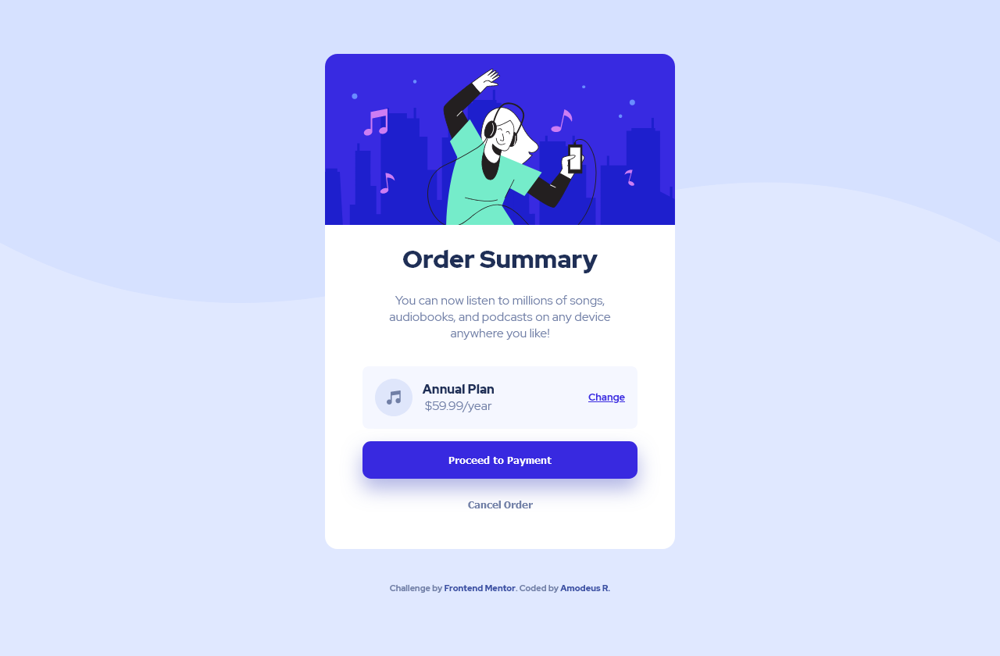
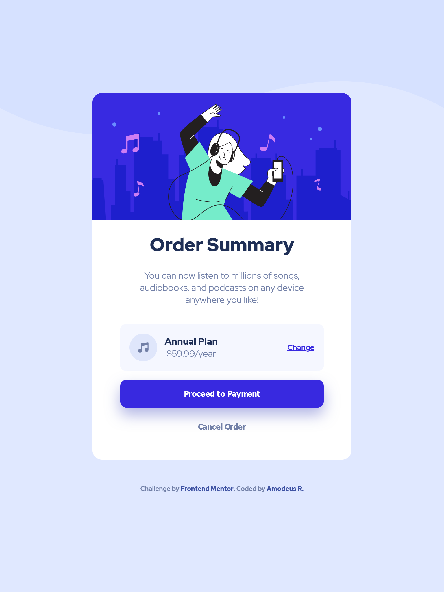
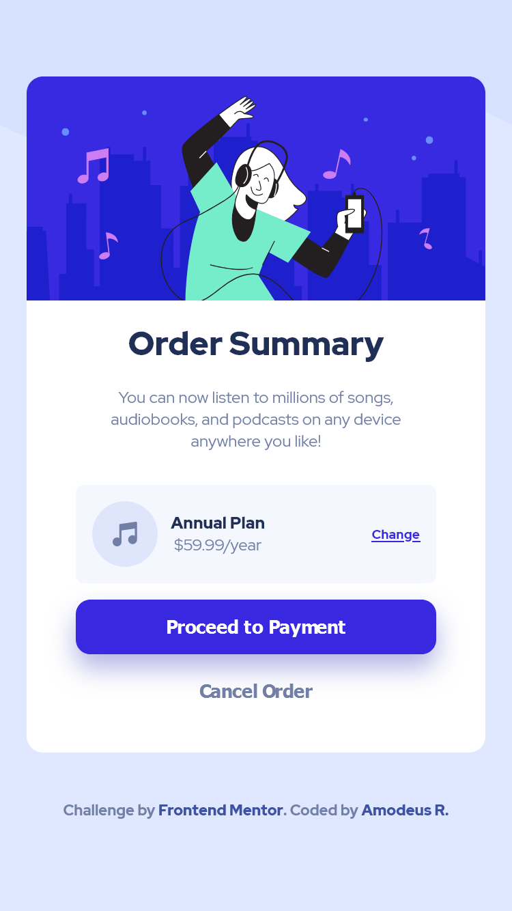

# Frontend Mentor - Solução ao Cartão de Sumário de Compra

Esta é uma solução ao [desafio Cartão de Sumário de Compra do Frontend Mentor](https://www.frontendmentor.io/challenges/order-summary-component-QlPmajDUj). Os desafios do Frontend Mentor visam ajudar a aperfeiçoar suas habilidades de programação através da construção de projetos realistas.

<h3 align="center">Idiomas</h3>
<p align="center">
<a href="../README.md">English</a> • <a href="#">Português</a>
</p>


## Índice

- [Visão Geral](#visão-geral)
  - [O desafio](#o-desafio)
  - [Capturas de tela](#capturas-de-tela)
  - [Links](#links)
- [Meu processo](#meu-processo)
  - [Desenvolvido com...](#desenvolvido-com)
  - [O que aprendi](#o-que-aprendi)
- [Autor](#autor)

## Visão geral

### O desafio

Usuários devem ser capazes de:

- Ver hover states para elementos interativos

### Capturas de tela

| Tela Desktop (1280px) | Tela iPad (768px) | Tela iPhone (375px) |
|---------|-------|------|
||||


### Links

- URL para o Site: [Github Pages](https://amodeusr.github.io/EP04-FrontendMentor/)

## Meu processo

### Desenvolvido com...

- Marcação semântica HTML
- Propriedades personalizadas CSS
- Flexbox
- CSS Grid
- Desktop-first workflow

### O que aprendi

Eu reenforcei meu conhecimento de Flexbox e Desenvolvimento Responsivo, visando uma boa UI para basicamente todos os tamanhos de telas com o mínimo de Media Queries.

Eu quebrei minha cabeça para fazer a imagem "ignorar" o padding do cartão enquanto mantendo sua responsividade. Ela estava ou ficando menor que o tamanho da div card ou não diminuía em telas menores. Além disso, eu estava tentando não usar posicionamento absoluto, então eu elaborei a seguinte solução utilizando-se de Flexbox e a função CSS Calc.

```html
<div class="card flex-column">
  <figure class="format-margin flex-column">
    
  </figure>
[...]
```
```css
.card__image {
  width: calc(100% + 6rem);
  margin-top: -3rem;
  border-radius: 1em 1em 0 0;  
}
```

## Autor

- Github - [@AmodeusR](https://www.your-site.com)
- Frontend Mentor - [@AmodeusR](https://www.frontendmentor.io/profile/AmodeusR)


